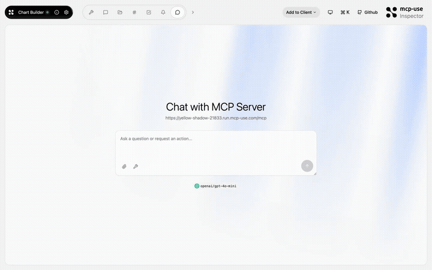
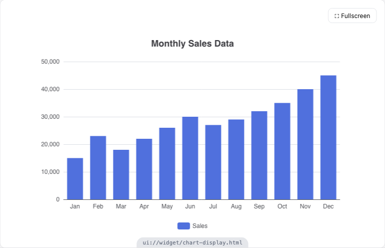

# Chart Builder — ECharts in your chat

<p>
  <a href="https://github.com/mcp-use/mcp-use">
    <picture>
      <source media="(prefers-color-scheme: dark)" srcset="https://raw.githubusercontent.com/mcp-use/mcp-use/main/static/logo_white.svg">
      <source media="(prefers-color-scheme: light)" srcset="https://raw.githubusercontent.com/mcp-use/mcp-use/main/static/logo_black.svg">
      
    </picture>
  </a>
  &nbsp;
  <a href="https://github.com/mcp-use/mcp-use">
    
  </a>
</p>

Interactive data visualization MCP App powered by [Apache ECharts](https://echarts.apache.org/). The model generates charts (bar, line, pie, scatter, radar, and more) that render live inside the conversation with streaming support.



## Try it now

Connect to the hosted instance:

```
https://yellow-shadow-21833.run.mcp-use.com/mcp
```

Or open the [Inspector](https://inspector.manufact.com/inspector?autoConnect=https%3A%2F%2Fyellow-shadow-21833.run.mcp-use.com%2Fmcp) to test it interactively.

### Setup on ChatGPT

1. Open **Settings** > **Apps and Connectors** > **Advanced Settings** and enable **Developer Mode**
2. Go to **Connectors** > **Create**, name it "Chart Builder", paste the URL above
3. In a new chat, click **+** > **More** and select the Chart Builder connector

### Setup on Claude

1. Open **Settings** > **Connectors** > **Add custom connector**
2. Paste the URL above and save
3. The Chart Builder tools will be available in new conversations

## Features

- **Streaming props** — charts render progressively as the model generates the ECharts config
- **10+ chart types** — bar, line, pie, scatter, radar, heatmap, treemap, sunburst, gauge, funnel
- **Theme support** — light and dark mode
- **Fullscreen mode** — expand charts for immersive viewing

## Tools

| Tool | Description |
|------|-------------|
| `create-chart` | Create an interactive chart from a title, chart type, and ECharts option object |

## Available Widgets

| Widget | Preview |
|--------|---------|
| `chart-display` |  |

## Local development

```bash
git clone https://github.com/mcp-use/mcp-chart-builder.git
cd mcp-chart-builder
npm install
npm run dev
```

The server starts at `http://localhost:3000/mcp` with the Inspector at `http://localhost:3000/inspector`.

## Deploy

```bash
npx mcp-use deploy
```

## Built with

- [mcp-use](https://github.com/mcp-use/mcp-use) — MCP server framework
- [Apache ECharts](https://echarts.apache.org/) — visualization library (bundled, no CDN required)

## License

MIT
